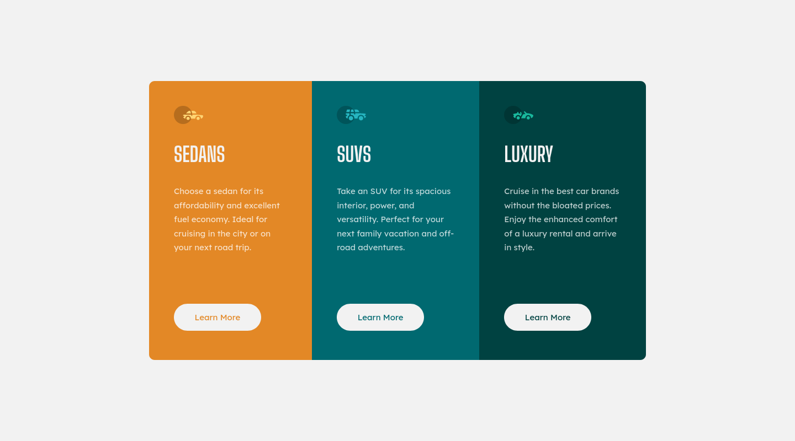

# Frontend Mentor - Order summary card solution

This is a solution to the [3-column preview card component challenge on Frontend Mentor](https://www.frontendmentor.io/challenges/3column-preview-card-component-pH92eAR2-). Frontend Mentor challenges help you improve your coding skills by building realistic projects. 

## Table of contents

- [Overview](#overview)
  - [The challenge](#the-challenge)
  - [Screenshot](#screenshot)
  - [Links](#links)
- [My process](#my-process)
  - [Built with](#built-with)
  - [What I learned](#what-i-learned)
  - [Continued development](#continued-development)
- [Author](#author)

## Overview

This challenge was solved using HTML and CSS only.

### The challenge

Users should be able to:

- Use the page on any screen size conveniently
- See hover states for interactive elements

### Screenshot

Desktop Screenshot (1440 x 800)

Mobile Screenshot (375 x 1502)

### Links

- Solution URL: [https://www.frontendmentor.io/solutions/mobile-first-design-using-flex-box-and-grid-U77gGzAfC](https://www.frontendmentor.io/solutions/mobile-first-design-using-flex-box-and-grid-U77gGzAfC)
- Live Site URL: [https://randykdev.github.io/learning-web-design/Frontend%20Mentor/3%20Column%20Preview%20Card/](https://randykdev.github.io/learning-web-design/Frontend%20Mentor/3%20Column%20Preview%20Card/)

## My process

### Built with

- Semantic HTML5 markup
- CSS custom properties
- CSS FLex Box
- Mobile-first workflow
- BEM CSS Naming Convention

### What I learned

- Using Outlines instead of Borders because outlines don't contribute or disturb the flow of the document. Its only for visual effects and does not affect the size of the element.
- Using box shadows instead of Outlines so as to get the rounded nature of the buttons as outlines couldn't be rounded
- Hiding contents visually, but can accessed by screen readers for accessibility purposes
- Using the css style, `overflow: hidden;` in cases where the parent's border radius should affect all children 

### Continued development

I would dive deeper into Sematic HTML  and CSS Best Practices

## Author

- Website - [Randy Kwalar](https://www.github.com/RandyKdev)
- Frontend Mentor - [@RandyKdev](https://www.frontendmentor.io/profile/RandyKdev)
- Twitter - [@RandyKdev](https://www.twitter.com/randykdev)
